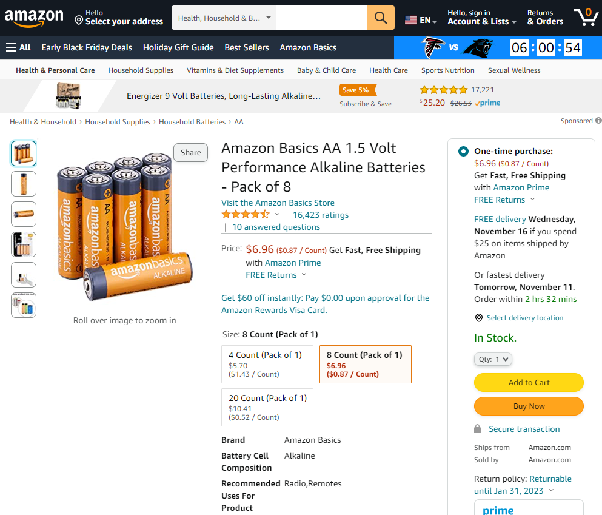

Run the command below to extract information from an Amazon product-page: https://www.amazon.com/dp/B081FGTPB7/
```
npx syphonx run $/examples/amazon/product-page.yaml
```

This should produce output similar to the following...
```json
{
  "name": "Amazon Basics AA 1.5 Volt Performance Alkaline Batteries - Pack of 8",
  "price": "$6.96",
  "availability": "In Stock."
}
```

The output should reflect the selected content on the page...


Here is the template that produced this result...
```yaml
url: https://www.amazon.com/dp/${asin}/
params:
  asin: B081FGTPB7
select:
  - name: name
    query: "#title"
  - name: price
    query: "#buybox .a-price .a-offscreen:first"
  - name: availability
    query: "#availability:first"
```

The `name` is extracted from an element with an id of `title`, and `price` is extracted from an element with a class of `a-offscreen` that is contained within an element with a class of `a-price` that is further contained within an element with an id of `buybox`.

This template is parameter-driven so you can run the command again with a different ASIN product number...
```
npx syphonx run $/examples/amazon/product-page.yaml --params="{asin:'B0787D6SGQ'}"
```

[Back to top](/README.md)
