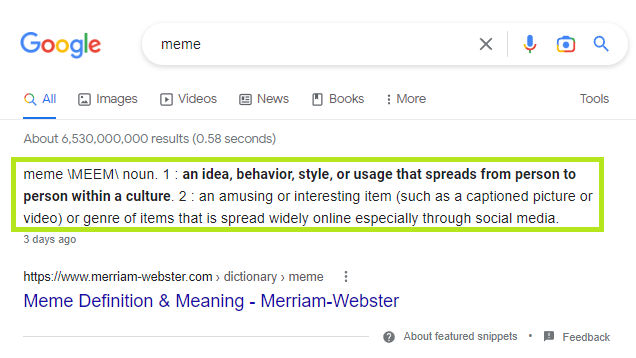

We can extend the [Google search example](google-search.md) to extract the description that appears above the search results highlighted below.



If you just want to see the solution, here is a revised template that does this.
```
npx syphonx view $/examples/google/search-2.yaml
npx syphonx run $/examples/google/search-2.yaml
```

If you want to make these modifications on your own, run the following command to download the original template from the cloud.
```
npx syphonx pull $/examples/google/search.yaml
```

Add a *description* field under the `select` statement.
```yaml
select:
  - name: description
    query: "[data-attrid='wa:/description']"
    ...
```


The full template should now look like the following.
```yaml
url: https://www.google.com/search?q=${search}
params:
  search: meme
select:
  - name: description
    query: "[data-attrid='wa:/description']"
  - name: search_result
    repeated: true
    query: "#search .g:has([data-header-feature])"
    select:
      - name: name
        query: "[data-header-feature] a h3"
      - name: excerpt
        query: "[data-content-feature]:has(span)"
      - name: href
        query: $('[data-header-feature] a').attr('href')
```

Run the template and we should see the new `description` in the output.
```json
{
  "description": "meme \\MEEM\\ noun. 1 : an idea, behavior, style, or usage that spreads from person to person within a culture . 2 : an amusing or interesting item (such as a captioned picture or video) or genre of items that is spread widely online especially through social media. 3 days ago",
  "search_result": [
    {
      "name": "Meme Definition & Meaning - Merriam-Webster",
      "excerpt": "The meaning of MEME is an amusing or interesting item (such as a captioned picture or video) or genre of items that is spread widely online especially ...",
      "href": "https://www.merriam-webster.com/dictionary/meme"
    }
  ]
}
```

Next let's try extracting the *"People also ask"* section. [Continue](google-search-3.md)

[Back to top](/README.md)
