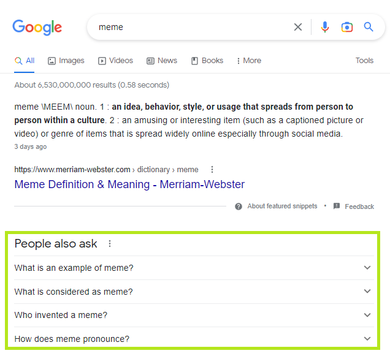

We can extend the [Google search example](google-search.md) to extract the questions that appear under *"People also ask"* as highlighted below.

<kbd></kbd>

If you just want to see the solution, here is a revised template that does this.
```
npx syphonx view $/examples/google/search-3.yaml
npx syphonx run $/examples/google/search-3.yaml
```

If you want to make these modifications on your own, run the following command to download the original template from the cloud.
```
npx syphonx pull $/examples/google/search.yaml
```

Add a `people_also_ask` field to the bottom of the `select` statement.
```yaml
select:
  ...
  - name: people_also_ask
    repeated: true
    query: $('span:contains("People also ask")').closest('[data-initq]').find('[data-q] [role=button]').filter('/\\?$/')
```

This one's a bit trickier as there aren't any attributes in the DOM with semantic meaning that make it easy for us. We're going to have to get a little more advanced. At the time of this writing, the questions can be targeted with a `data-q` attribute. This `data-q` attribute might be used for other things, so let's try to pick up on the text of *"People also ask"* to find the container for the `data-q` nodes. The good news is we can handle this using a jQuery selector.

The jQuery selector `$('span:contains("People also ask")').closest('[data-initq]').find('[data-q] span')` basically does the following.
1. Find the node that contains the text `People also ask`.
2. Find the containing parent node with a `data-initq` attribute that looks like `<div class="data-initq">...</div>`.
3. Find all the child nodes with a `data-q` attribute that looks like `<div class="data-q">...</div>`
4. Select the contained node with a `role` attribute equal to `button` that looks like `<div role='button'>...</div>`.
5. Filter the results by removing hits that don't end in a question mark to preven other junk data that sometimes comes through. That's a regular expression inside the filter in case you're wondering.

The full template should now look like the following (with the `description` from the [previous example](google-search-2.md)).
```yaml
url: https://www.google.com/search?q=${search}
params:
  search: meme
select:
  - name: description
    query: "[data-attrid='wa:/description']"
  - name: search_result
    repeated: true
    query: "#search .g:has([data-header-feature])"
    select:
      - name: name
        query: "[data-header-feature] a h3"
      - name: excerpt
        query: "[data-content-feature]:has(span)"
      - name: href
        query: $('[data-header-feature] a').attr('href')
  - name: people_also_ask
    repeated: true
    query: $('span:contains("People also ask")').closest('[data-initq]').find('[data-q] [role=button]').filter('/\\?$/')
```

Run the template and we should see the new `people_also_ask` data in the output.
```json
{
  "description": "...",
  "search_result": [],
  "people_also_ask": [
    "What is an example of meme?",
    "What is considered as meme?",
    "Who invented a meme?",
    "How does meme pronounce?"
  ]
}
```

[Back to top](/README.md)
