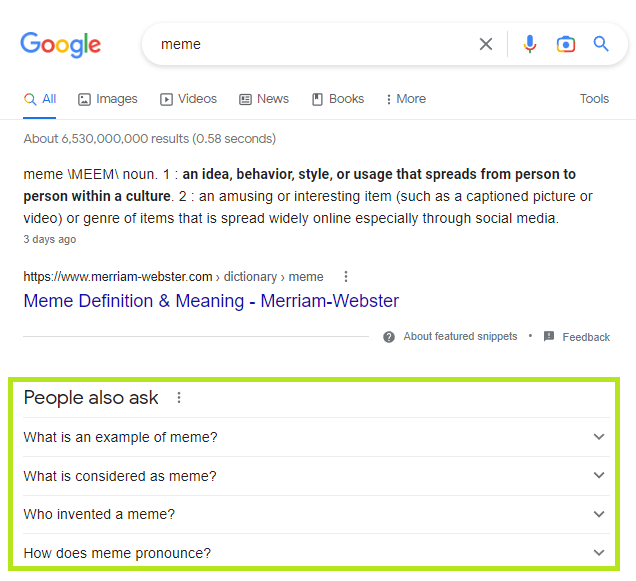

This is a detailed analysis of how to extract the questions appearing under *"People also ask"* on the Google search results page.

<kbd></kbd>

Here is a simplified view of the how the questions appear (at the time of this writing) in the the HTML.

```html
<div data-initq="meme">
  <div>
    <div role="heading">
      <span>People also ask</span>
    </div>
  </div>
  <div>
    <div>
      <div data-q="What is an example of meme?">
        <div role="button">
            <span>What is an example of meme?</span>
        </div>
      </div>
    </div>
    <div>
      <div data-q="What is an example of meme?">
        <div role="button">
            <span>What is considered as meme?</span>
        </div>
      </div>
    </div>
    ...
  </div>
</div>
```

The questions appearing under *"People also ask"* can be targeted with a `data-q` attribute. However, this attribute name itself is generic enough that it might be used elsewhere on this or other pages. So it would be prudent to scope the nodes within a container.

Unfortunately, there are several challenges here. The content that contains the `data-q` nodes isn't as decorated with attributes that have nice semantic meaning as is typically the case. Also there is a `heading` node but it's fairly buried and doesn't share an immediate common ancestor with the `data-q` nodes.

When there's nothing else to go on, a good strategy is to target the text that appears on the page, *"People also ask"* in this case, and then drill down to find the questions. But this requires some non-trivial DOM tree traversals. Another challenge can be that plain CSS selectors in other environments don't support targeting text content, only elements and attributes.

The good news is this is exactly the kind of problem that [jQuery](https://en.wikipedia.org/wiki/JQuery) selectors were designed to handle. Here is a jQuery selector that successfully navigates all the compexities discussed above.

```
$('span:contains("People also ask")')
    .closest('[data-initq]')
    .find('[data-q] [role=button]')
    .filter('/\\?$/')
```

This jQuery selector basically does the following.
1. Find the node that contains the text `People also ask`.
2. Traverse to the *closest* containing parent node with a `data-initq` attribute.
3. Drill down to *find* all the child nodes with a `data-q` attribute.
4. Select the contained node with a `role` attribute equal to `button`.
5. Narrow the results using a *filter* to remove hits that don't end in a question mark to prevent other junk data that sometimes comes through.
> That's a [Regular expression](https://developer.mozilla.org/en-US/docs/Web/JavaScript/Guide/Regular_Expressions) (or *regex* for short) inside the filter in case you're unfamiliar with how those work. The regex `/\\?$/` basically matches a question mark `?` at the end of a string. The question mark has to be escaped with a backslash because it otherwise has special meaning in a regex. The `$` designates the end of the string. Note the backslash itself has to be escaped within a string which is why there are two backslashes instead of one.

[Go back](google-search-3.md)
